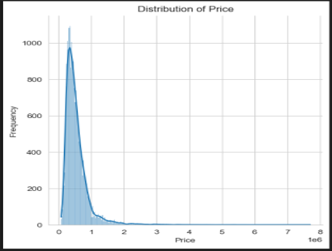
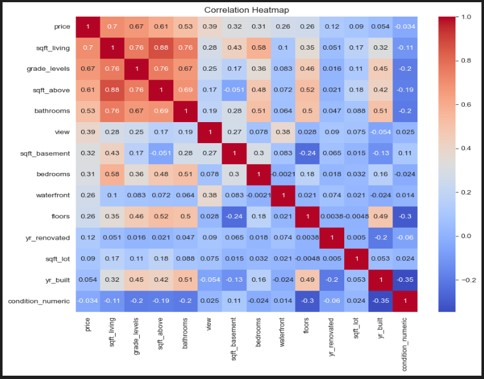
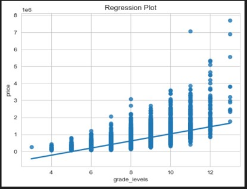
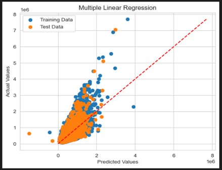

# UTILIZING MULTIPLE REGRESSION ANALYSIS TO PREDICT HOUSE PRICES IN KING COUNTY

# Overview

"Upgrading older properties with renovations like kitchen and bathroom updates, adding bedrooms, and improving curb appeal increases their value by 20%." Source: [Mashvisor]. 

In numerous developed countries, housing prices have experienced significant growth over the past few decades. However, it is crucial to recognize that housing prices can deviate from their sustainable levels, leading to potential macroeconomic and financial stability concerns. Monitoring and assessing the sustainability of house prices is essential. This is according to the [IMF Working Paper of 2018 by Nan Geng](https://www.elibrary.imf.org/view/journals/001/2018/164/001.2018.issue-164-en.xml).

## Business Understanding
Some homeowners are eager to sell, but certain houses are undervalued due to wear and tear. Housing prices can fluctuate based on market trends and buyer preferences. Homeowners aim to increase their property value for higher selling prices, but they lack knowledge and insights on effective strategies to do so.

Our analysis and modelling aimed to help homeowners looking to sell their houses make informed decisions by assessing how factors like home condition, size, renovations and more can impact their home's estimated value.

### Objectives
1. To find out whether the year the house was built and/or renovated affects the sale price of a house.
2. To establish the effect of qualitative features of a house (grade, condition e.tc) on its sale price
3. To establish the effect of quantitative features of a house (bedrooms, square footage) on its sale price.

## Data Understanding
The dataset provided (``kc_house_data.csv``) has information on the features of single-family house sales between 2014 and 2015. More information on this features is found in this link [Residential Glossary of Terms](https://info.kingcounty.gov/assessor/esales/Glossary.aspx?type=r#g). The file ``column_names.md`` contains column descriptions.

- The analysis was based on King County data set.

- It had a total of 21,597 records, containing 20 columns and 21,597 rows. 

- Timeframe of the data is 2014 to 2015. 

- Each row contains data of an  individual house, which is indexed by a unique house id. 

- The data has numerical and categorical variables.

**Below is a list of the columns**:
1.	id: a notation for a house
2.	date: Date house was sold
3.	price: Price is prediction target
4.	bedrooms: Number of Bedrooms/House
5.	bathrooms: Number of bathrooms/bedrooms
6.	sqft_living: square footage of the home
7.	sqft_lot: square footage of the lot
8.	floors: Total floors (levels) in house
9.	waterfront: House which has a view to a waterfront
10.	view: Has been viewed
11.	condition: How good the condition is ( Overall ). 1 indicates worn out property and 5 excellent.
12.	grade: Overall grade given to the housing unit, based on King County grading system. 1 poor ,13 excellent.
13.	sqft_above: Square footage of house apart from basement
14.	sqft_basement: Square footage of the basement
15.	yr_built: Year built
16.	yr_renovated: Year when house was renovated
17.	zipcode: zipcode
18.	lat: Latitude coordinate
19.	long: Longitude coordinate
20.	sqft_living15: Living room area in 2015(implies-- some renovations) This might or might not have affected the lotsize area
21.	sqft_lot15: lotSize area in 2015(implies-- some renovations)

## Modeling
The model buidling began with checking the distribution of price. As per the diagram below, linear regression is the optimal method for this extensive dataset due to the non-normal distribution of the dependent variable, price.

### Collinearity

We also checked for collinearity of features. 

It was noted that ``sqft_living`` is strongly correlated with two other predictor variables.

Six (6) models were built

1. Base Model (Grade)
2. All features excluding the dropped features
3. The time factor (year built and year renovated).
4. Qualitative features (categorical variables). 
5. Quantitative features (numerical variables).
6. Quantitative features, adding a qualitative feature at a time. 

### Base Model
- The model showed that high grade impacts positively on the price of a house. 

### Ideal Model
- out of the six models, our analysis found that the fifth model was the best fit in predicting house prices.
- The model incorporated the numerical features and gave an **R squared of 0.84**. Approximately 84.3% of the variation in the dependent variable (price) can be explained by the numerical independent variables. 
- Other statistics of the model are: 
   - F-statistic 0f 2.188e+04 – indicating that the regression model is statistically significant
   - p-values (below 0.05) – indicating statistical significance of the coefficients. 

## Regression Results
- 
The model is a good fit since the training data and test data do not over fit or underfit

## Conclusion
- In conclusion, home sellers should take in the following:
  - Consider increasing the space of the house, by increasing the number of floors, bathrooms & the size of basement & above ground area
  - Highly graded houses fetch higher prices. Waterfront and views, also increase the value of houses. 
  - The newer the  house, the higher the price, similarly, the most recently renovated houses fetch higher prices. Therefore, sellers need to renovated their houses.
   
- Models that incorporate other features such as proximity to amenities, the nature of geographical features and the locality's weather conditions have an impact on a property's sale value.
- Furthermore, it would be interesting to investigate whether certain months and seasons have an impact on the demand for homes.
